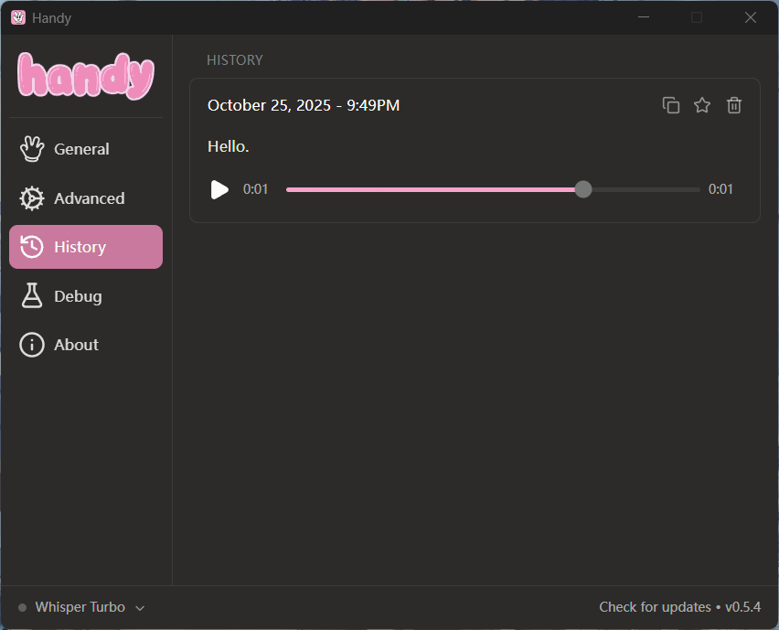
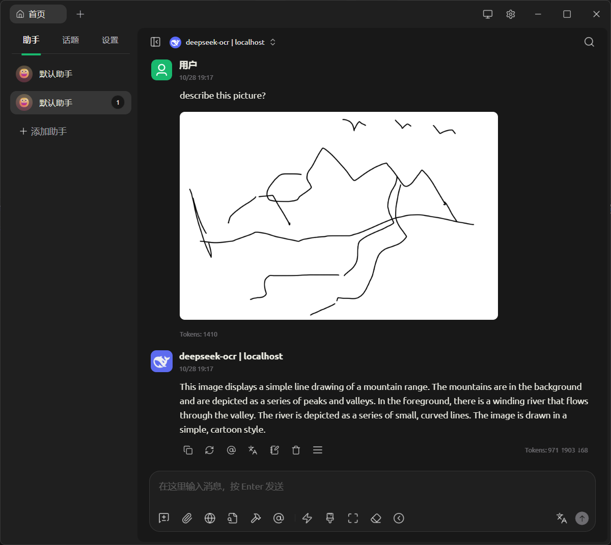
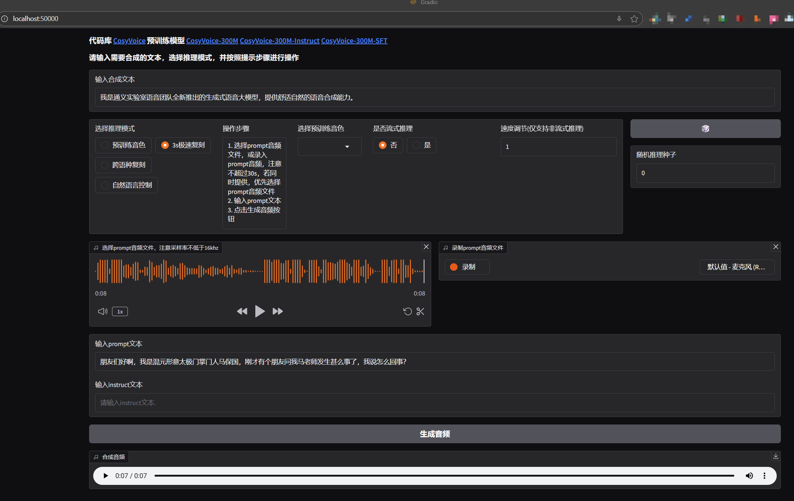
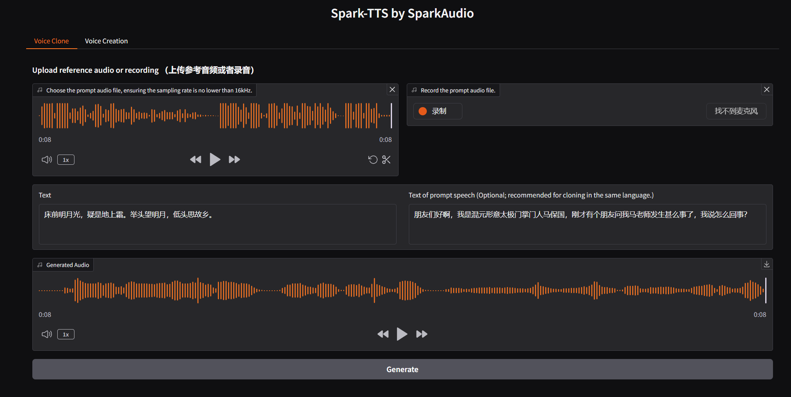
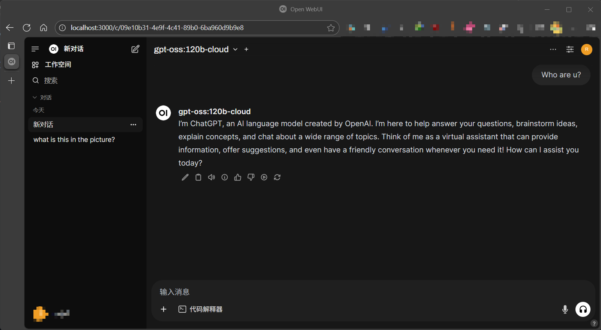

personal-ai-suite
-----------------

>   个人AI套件：收录一批可用于个人电脑上的 AI 类应用软件（大部分为开源项目），以助力于提高办公与学习效率。

### ASR (Automatic Speech Recognition) 语音识别

目前测试下来，好像对英语识别比较好，长段中文识别不佳。

- [Handy](https://github.com/cjpais/Handy): 离线语音转文字 (Speach-to-Text) 应用，基于 `Rust` 与 `Tarui` 实现。
- [Whisper.cpp](https://github.com/ggml-org/whisper.cpp): 底层实现以及相关 ASR 模型。
- [WhisperLiveKit](https://github.com/QuentinFuxa/WhisperLiveKit): 基于 fast-whisper 实现的实时语音识别服务。

### OCR (Optical Character Recognition) 光学文字识别

- 🎉[DeepSeek-OCR](https://github.com/deepseek-ai/DeepSeek-OCR): `DeepSeek` 官方实现的视觉识别解决方案。
- [deepseek_ocr_app](https://github.com/rdumasia303/deepseek_ocr_app): DeepSeek-OCR 一种 web 应用界面实现。
- [deepseek-ocr.rs](https://github.com/TimmyOVO/deepseek-ocr.rs): 另一种基于 Rust 实现的客户端。
- [DeepSeek-OCR-Web](https://github.com/fufankeji/DeepSeek-OCR-Web): 找到另一个版本，似乎支持 pdf 文档。
- 更多：见 [ocr-demo README](ocr/ocr-demo/README.md) 。

### TTS (Text to Speech) 文字转语音

- 云商：微软（Microsoft Azure Cognitive）提供了一些音色效果比较好的 TTS 服务，抖音剪映也有。(国内外有很多提供该服务的云服务商，不一一赘述，试用付费标准不一)
- 声音音色克隆：[GPT-SoVITS](https://github.com/RVC-Boss/GPT-SoVITS)，[F5-TTS](https://github.com/SWivid/F5-TTS)，[CosyVoice](https://github.com/FunAudioLLM/CosyVoice)，[IndexTTS](https://github.com/index-tts/index-tts)，[Spark-TTS](https://github.com/SparkAudio/Spark-TTS)
- 预处理：[声音分离](https://vocalremover.org/zh/)，[uvr-gui](https://github.com/Anjok07/ultimatevocalremovergui)，还有facebook 停止维护的 [demucs](https://github.com/facebookresearch/demucs)

#### `cosy-voice` 演示

马保国克隆声音试听：[mabaoguo-sound](assets/mabaoguo-sound.aac)

#### `spark-tts` 演示

马保国克隆声音《静夜思》试听：[mabaoguo-jingyesi](assets/mabaoguo-jingyesi.wav)

### LLM Chat

- 本地模型服务：[Ollama](https://ollama.com/)
- Chat WebUI：网页端 [Open WebUI](https://github.com/open-webui/open-webui)，建议 `docker` 部署，参考 [chat/open-webui/](chat/open-webui) 读我以及 yaml 配置文件；桌面端 [CherryStudio](https://www.cherry-ai.com/)，支持的第三方比较多；其它 GUI 客户端不一一列出了，请自行搜索。
- 大厂大模型：如腾讯 [元宝](https://yuanbao.tencent.com/)，抖音 [豆包](https://www.doubao.com/)，阿里 [通义](https://www.tongyi.com/) 以及墙外的 [ChatGPT](https://chatgpt.com/) 与 [Grok](https://grok.com/) 等等。

### ComfyUI

- Windows 环境建议下载秋叶大佬的[整合包](https://space.bilibili.com/12566101)，免去各种配置问题。具体下载地址，见作者B站相关视频，这里有个可参考的 [wiki](https://comfyui-wiki.com/zh/install/install-comfyui/aaaki-comfyui-launcher-user-guide) 。
- Linux 建议 `docker` 部署，可以参考这个仓库：[ComfyUI-Docker](https://github.com/YanWenKun/ComfyUI-Docker) 。